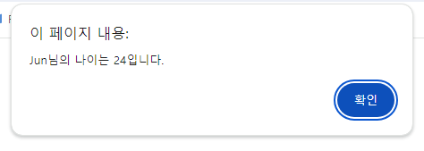

# Modern-JavaScript-Study
# 자바스크립트 시작하기
## 웹 개발에서 자바스크립트의 역할
부분 | 설명
-- | --
클라이언트 | 사용자 눈에 보이는 부분
서버 | 사용자 눈에 보이지 않는 부분

클라이언트 -> 관련정보 요청 -> 서버<br>
서버 -> 관련정보를 찾아서 -> 클라이언트

### 프론트앤드 개발과 자바스크립트
```
쇼핑몰에서 상품을 장바구니에 추가하고 추가된 상품을 보여주고
장바구니의 모든 상품의 총 금액을 보여주는 부분은 프론트앤드 개발입니다.
이러한 개발을 쉽게 할 수 있게 도와주는 프레임워크나 라이브러리를 사용할 수 있습니다.
```

종류 | 기능
-- | --
`React` | 페이스북에서 만든 라이브러리, 사용자 인터페이스를 만들 수 있습니다.
`Vue.js` | 사용자 인터페이스를 만들어주는 프레임워크
`Angular` | 구글에서 개발한 프레임워크로 큰 규모의 웹 사이트를 개발하는데 적합합니다.

### 백앤드 개발과 자바스크립트
```
서버 쪽 개발을 말합니다.
DB 수정, 조회, 서버에서 처리한 결과를 클라이언트로 보내는 프로그램 등을 개발하는데 좋습니다.
```
프레임워크로는 `Node.js`가 있습니다.

## 스크립트
### 인라인 스크립트
HTML 태그 안에 작성하는 스크립트를 `인라인 스크립트`라고 합니다.
```html
<button onclick="alert('안녕')">alert</button>
<button onclick="confirm('Yes or No')">confirm</button>
<button onclick="var age = 1; age = prompt('나이를 입력하세요',age) console.log(age)">prompt</button>
```

### 내부 스크립트
\<body>의 닫는 태그인 \</body> 앞에 주로 작성되는 스크립트가 `내부 스크립트` 입니다.

```html
<body>
    <p>새로고침 하세요</p>
    <script>
        function random(num) {
            return Math.floor(Math.random() * num)
        }
        function bgChange() {
            const rndCol = 'rgb(' + random(255) + ',' + random(255) + ',' + random(255) + ')'
            document.body.style.backgroundColor = rndCol
        }
        bgChange()
    </script>
</body>
```

#### 인라인 스크립트와 내부 스크립트의 단점
- 복잡합니다.
- 한눈에 알아보기 쉽지 않습니다.
- 수정사항이 있을 경우 하나하나 다 찾으러 다녀야 합니다.

그렇기 때문에 `외부 스크립트`를 사용합니다.

### 외부스크립트
```html
<script defer src="파일경로"></script>
```
\<head> 태그안에 삽입합니다.

- defer 속성
    - 무조건 문서를 다 가져온 후 스크립트 소스를 실행하도록 지정합니다. (생략가능)

```
useStrict 모드
엄격 모드, 스트릭트 모드라고 합니다.
최신버전에 맞는 소스를 작성할 때 사용합니다.

기본적으로 느슨한 모드(sloppy mode)로 js는 동작합니다. 근데 useStrict를 사용해서 엄격한 모드로 동작하게 하면 자바스크립트 엔진을 최적화하는 데 문제가 있는 소스를 걸러냅니다.
```

# 변수와 자료형
## 입출력 방법
### 함수 사용
함수 | 설명
-- | --
alert() | 알림창을 표시하는 함수
confirm() | 확인버튼과 취소버튼이 있는 창을 표시하는 함수
prompt() | 간단한 값을 입력받는 창을 표시하는 함수

```
alert(내용)

confirm(내용)

prompt(내용)
```

### console.log() - 콘솔창에 결과 출력
js 소스코드를 작성하면서 중간중간 제대로 동작하는지 확인용도로 자주 사용합니다.

```
console.log(내용)
console.log(변수)
```

### document.write() - 웹 브라우저에 결과 출력
```js
name = 'Jun'
document.write("My name is " + name)
```
## 변수
값을 담는 바구니

### 변수의 규칙
1. 변수 이름은 숫자로 시작할 수 없고 공백을 포함하지 않는다
2. js는 영문자의 대/소문자를 구분한다.
3. 한 단어로 이루어진 변수는 소문자로, 두 단어 이상으로 이루어진 변수는 `_` 혹은 `카멜표기법`을 사용한다
4. 예약어는 변수 이름으로 사용할 수 없다
5. 무의미한 변수명은 사용하지 않는다.

```
카멜 표기법의 예) nameList, totalScore, userName, ... 등
```

### 변수 사용법
1. var 변수보다 let, const를 사용합니다.
2. 전역변수는 최소한으로 사용합니다.
3. 객체선언은 const를 사용합니다.

### 변수 선언 및 값 할당
```js
let 변수명1
const 변수명2 // 상수. 상수: 재선언x, 재할당x

변수명1 = 값
```

예약어 | 선언하지 않고 사용할 경우 | 재선언 | 재할당
--|--|--|--
var | 오류없음(호이스팅 발생) | O | O
let | 오류발생 | X | O
const | 오류발생 | X | X

```
호이스팅
변수를 사용하기 전에라도 '이런 변수가 있다' 하고 기억해 두므로 선언한 것과 같은 효과를 뜻함
```
## 자료형
구분 | 설명
-- | --
원시 유형 자료형 | 하나의 값만 저장하는 자료형.<br>`number, string, boolean, undefined, null, symbol`
객체 | 원시 유형 이외의 모든 자료형


### typeof() 무슨 자료형인지 알아내는 함수
### 숫자형 & 논리형
```js
// typeof(값 또는 함수)
typeof(10) // number
typeof('10') // string
typeof(3.14) // number
typeof(true) // boolean
```
### 문자열
#### 특수기호
특수문자를 표시하려면 백슬래시 기호를 사용해야 합니다.
이스케이프 문자 | 설명
-- | --
\ddd | 8진수
\xddd | 16진수
\\\ | 백슬래시
\\` | 작은따옴표
\\" | 큰따옴표
\b | 백스페이스
\f | 폼 피드 문자
\n | 줄 바꿈
\r | 캐리지 리턴 문자
\t | 탭

#### 템플릿 리터럴
문자열과 변수, 식을 섞어서 하나의 문자열을 만드는 표현 형식입니다.
```js
let name = 'Jun'
let classroom = 1

console.log(`${name}님, ${classroom}반으로 오세요`)
```


### undefined & null
```
nudefined는 값이 할당되지 않았을 때 변수의 초깃값.

null은 값이 없거나 유효하지 않은 값이라는 의미
```
```js
let userName
console.log(userName) // undefined
```

### 객체
```js
let book = {
    title: '제목', // 문자열
    bookDate: '2023-11-01', // 문자열
    pages: 500, // 숫자
    finished: false, // 논리값
}

book.title // title의 값 가져오기
book["title"] // title의 값 가져오기
```

### 배열
```js
let color = ['red', 'yellow', 'black']
let empArr = []

console.log(color[2]) // 'black'
```
### Symbol
심벌의 특징은 `유일성을 보장`합니다.
```js
let id = Symbol()
const member = {
    name: 'Jun',
    [id]: 12345 // 심벌을 키로 지정할 때 []로 묶습니다
}
```


#### Symbol에 설명 추가하기
```js
let grade = Symbol("grade")
member[grade] = "Gold"
```

## 형변환
```js
let one = '10'
let two = 5

one + two // '105'

one - two // 5
```
```
+ 연결연산자를 사용해서 문자열 + 숫자형을 하면 문자열이 되지만
뺄셈 기호 - 연산자를 하면 숫자형이 됩니다.
```

### Number() - 숫자형으로 형변환
### 문자열로 형변환
#### toString()
```js
let num = 10
num.toString() // '10'
num.toString(2) // '1010'. 2진수 문자열
```

#### String()
```js
let isFull = false
String(isFull) // 'false'
```

### Boolean()
```js
Boolean(5*4) // true
Boolean("Hi?") // true
Boolean(undefined) // false
```

## 화씨 온도를 섭씨 온도로 변환하기
```js
// 화씨온도 -> 섭씨온도
// 공식: 섭씨온도 = (화씨온도 - 32) / 1.8
let c
let f = parseFloat(prompt("화씨온도를 입력하세요"))

// c = Math.floor(parseFloat((f - 32) / 1.8))
c = parseFloat((f - 32) / 1.8).toFixed(1)

alert(`화씨온도는 ${f}이고 섭씨온도는 ${c}입니다.`)
```

# 연산자와 제어문
## 연산자
### 산술연산자
연산자 | 기능 | 사용 예
-- | -- | --
\+ | 더하기 | c = a + b
\- | 빼기 | c = a - b
\* | 곱하기 | c = a * b
/ | 나누기 | c = a / b
% | 나머지 구하기 | c = a % b
++ | 1 증가 | a++
-- | 1 감소 | a--

### 연결 연산자 +
```js
let name = 'Jun'
console.log(name + '님 안녕하세요')
```

### 할당 연산자
연산자 | 기능 | 사용 예
-- | -- | --
= | 오른쪽을 왼쪽에 할당 | y = x
+= | y = y + x | y += x
-= | y = y - x | y -= x
*= | y = y * x | y *= x
/= | y = y / x | y /= x
%= | y = y % x | y %= x

### 비교연산자
연산자 | 기능
-- | -- 
== | 값이 같으면 true
=== | 값과 데이터 유형이 같으면 true
!= | 값이 같지 않아야 true
!== | 값과 데이터 유형이 모두 같지 않아야 true
< | 왼쪽 피연산자 값이 오른쪽 보다 작아야 true
<= | 왼쪽 피연산자 값이 오른쪽 보다 작거나 같으면 true
\> | 왼쪽 피연산자 값이 오른쪽 보다 커야 true
\>= | 왼쪽 피연산자 값이 오른쪽 보다 크거나 같으면 true

### 논리연산자
연산자 | 기능
-- | --
! (Not 연산자) | 피연산자 값과 반대의 값을 가져야 true
&& (AND 연산자) | 피연산자 값이 모두 true일 경우 true
\|\| (OR 연산자) | 피연산자 값이 하나라도 true일 경우 true

## 조건문
```js
if (조건1) {
    // 조건 1이 참일 경우 실행
} else if(조건2) {
    // else if문은 조건이 여러 개일 경우 사용
    // 조건이 하나만 있을 경우 생략 가능
    // 조건 2가 참일 경우 실행
} else {
    // 어떤 조건도 맞지 않을 경우 실행
}
```
### 조건연산자
```js
// (조건) ? true일 때 실행할 명령 : false일 때 실행할 명령

let min = (num1 < num2) ? num1 : num2
```

### 짝수와 홀수 판별 프로그램
```js
let x = prompt("숫자를 입력하세요")

if(x !== null) {
    (x % 2 === 0) ? alert("짝수") : alert("홀수")
} else {
    alert("취소")
}
```

### switch 문
```js
let subject = prompt("과목 선택: 1-HTML, 2-CSS, 3- JavaScript")
if(subject !== null) {
    switch(subject) {
        case "1": 
            document.write("HTML")
            break
        case "2": 
            document.write("CSS")
            break
        case "3": 
            document.write("JavaScript")
            break
        default:
            document.write("다시")
    }
}
```

## 반복문
### for문
```js
for(초깃값; 조건; 증가식) {...}
```
### forEach문
```js
const numbers = [1, 2, 3, 4]
numbers.forEach(function(number) {
    document.write(`${number}`)
})
```
### for...in문
반복해서 객체의 값을 가져와서 처리할 수 있게 합니다.
```js
for (key in book) {
    document.write(`${key} : ${book.key}`)
}
```
### for...of문
문자열이나 배열과 같은 반복가능 자료에서 사용되는 반복문입니다.
```js
const numbers = [1, 2, 3, 4]
// numbers.forEach(function(number) {
//     document.write(`${number}`)
// })
for(number of numbers) {
    document.write(`${number}`)
}
```

### while문 do...while문
차이는 `while문`은 조건이 참일 경우 실행되고 `do...while문`은 무조건 반복문을 한번 실행 후 조건을 체크합니다.

### break와 continue
`break`는 해당 반복문의 종료조건이 되기 전에 반복문을 빠져나올 때 사용합니다.

`continue`문은 실행 중인 반복문장을 건너뛰고 반복문의 맨 앞으로 되돌아가서 다음 반복과정으로 넘어갑니다.

### 소수인지 여부 확인하는 프로그램
```js
let n = parseInt(prompt("자연수를 입력하세요"))
let i = 2
console.log(typeof(i))
if(n !== null && n > 2) {

    while(i < n) {
        if (n % i !== 0) {
            i++
            console.log("i: " + i)
            if(i === n) {
                document.write("소수")
                break
            }
            continue
        }
        else {
            document.write("소수X")
            break
        }
    }
} else if(n === 2) {
    document.write("소수")
} else if(n === 1) {
    document.write("소수도 합성수도 아님")
} else {
    alert("취소")
}
```

## 마무리문제
### 1번 10보다 큰 자연수 찾기
```js
const arrs = [1, 3, 5, 7, 9, 11, 13, 15, 17, 19]
let arrs2 = []
let j = 0
for(let i = 0; i < arrs.length; i++) {
    if(arrs[i] > 10) {
        arrs2[j] = arrs[i]
        j++
    }
}

for(let i = 0; i < arrs2.length; i++) {
    document.write(arrs2[i] + " ")
}
```

### 2번 주어진 수에서 짝수만 더하기
```js
let n = parseInt(prompt("1보다 큰 수를 입력하세요"))
let i = 0
let j = 0
if(n !== null && n > 1) {
    while(i <= n) {
        if(i % 2 === 0) {
            j += i
            document.write(`${i} --- ${j}\n\n`)
        }
        i++
    }
} else {
    alert("잘못입력")
}
```


# 함수
`함수`는 `동작해야 할 목적대로 여러 개의 명령을 묶는 것` 입니다.

### add 함수
```js
function addNum(n1, n2) { // 함수선언. 매개변수 n1, n2
    return n1 + n2
}

let num1 = 10
let num2 = 20
let sum = addNum(num1, num2)
// 함수실행. 매개변수 num1, num2넘기기. 반환값을 sum 변수에 저장
console.log(sum)
```


### 매개변수의 기본값 지정하기
```js
function addNum(a, b = 3, c = 10) {
    return a + b + c
}
console.log(addNum(5, 10, 15))
console.log(addNum(5, 10))
console.log(addNum(5))
```


## 스코프 - 변수의 유효범위
### 지역변수 (= 지역스코프)
특정영역 안에서만 사용가능
```js
function sum(a, b) {
    let result = a + b
    return result
}
console.log(result) // error
```

### 전역변수 (= 전역스코프)
프로그램 전체에서 사용가능
```js
var hi = 'hello'

function greeting() {
    console.log(hi)
}

greeting() // hello 출력
```
```
자바스크립트에서는 예약어 없이 변수를 선언하면 해당 변수는 전역변수가 됩니다.

let이나 const를 사용한 변수도 프로그램의 맨 앞에 선언하면 프로그램 전체에서 사용할 수 있습니다. 그런데 이때는 '전역 스코프를 가진다' 하지 않고 '스크립트 스코프를 가진다'라고 합니다.
```

### 블록 스코프
```
let나 const를 사용해 만든 변수는 기본적으로 변수가 선언된 블록 안에서만 유효합니다. 이것을 '블록 스코프를 가진다'라고 하고 '블록변수'라고 합니다.
```
## 익명함수
### 변수에 할당해서 사용하는 익명함수
```js
// 익명함수
let sum = function(a,b) {
    return a+b
}
console.log(`함수 실행 결과 : ${sum(10, 20)}`)
```


### 즉시 실행 함수
한 번만 실행하는 함수일 경우 함수를 정의하면서 동시에 실행시킬 수 있습니다. 이것을 `즉시 실행 함수`라고 합니다.
```js
// 즉시 실행 함수
(function(a,b){
    let sum = a+b
    console.log(sum) 
}) (10, 20)
```

### 화살표 함수 (= 애로펑션(arrow function))
- 표현식을 사용해서 함수를 정의할 경우에만 사용합니다.
- 매개변수가 없을 경우 {}를 생략할 수 있습니다.
```js
// 화살표 함수
let hi = function() {
    console.log('안녕')
}
hi()
// 위와 같은 함수를 화살표 함수로 변형
let bye = () => console.log('잘가')
bye()
```


## 콜백함수
콜백함수는 다른 함수의 인수로 사용하는 함수를 가리킵니다.
```js
// 콜백 함수
function showData(name, age) {
    alert(`${name}님의 나이는 ${age}입니다.`)
}
function getData(callback) {
    let userName = prompt("이름을 입력하세요")
    let userAge = parseInt(prompt("나이를 입력하세요"))

    callback(userName, userAge)
}
getData(showData)
```




## 자바스크립트 함수는 1급 시민
- 1급 시민 조건
    1. 변수에 할당할 수 있어야 합니다.
    2. 다른 함수의 인자로 사용할 수 있어야 합니다.
    3. 다른 함수에서 반환값으로 반환할 수 있어야 합니다.
### 변수에 함수 할당
```js
// 변수에 함수 할당
let sum = (a, b) => a + b
sum(2, 10)

function add(a, b) {
    return a + b
}
let sum2 = add
console.log(sum2(2, 10))
```


### 함수를 다른 함수에 전달
```js
// 함수를 다른 함수로 전달
function hello() {
    return "안녕하세요"
}
function bye() {
    return "잘가세요"
}
function userCheck(name, fn) {
    console.log(`${name}님`, fn())
}
userCheck("Jun", hello)
userCheck("Kim", bye)
```


### 함수에서 다른 함수반환
```js
// 함수에서 다른 함수로 반환
let init = () => {
    return function(a, b) {
        return a - b > 0 ? a - b : b - a
    }
}
console.log(`${init()(10, 20)}`)
```


## 전개구문
전개구문은 배열처럼 값이 다양한 자료를 한꺼번에 인수로 넘겨주거나 배열과 배열을 합할 때 배열을 하나의 덩어리로 처리해야 할 때 아주 유용합니다.
```js
// 전개구문: '...'기호를 사용
// 나머지 매개변수
function addNum(a, b) {
    return a + b
}

addNum(10, 20)          // 30
addNum(10, 20, 30, 40)  // 30

function addNum(...numbers) { // 나머지 매개변수
    let sum = 0

    for(let number of numbers) {
        sum += number
    }

    return sum
}

console.log(addNum(10, 20))          // 30
console.log(addNum(10, 20, 30, 40)) // 100
```

나머지 매개변수는 매개변수 중 마지막에 작서해야 합니다.

## 타이머 함수
실행할 함수와 시간을 지정하는 함수입니다. 타이머 함수에 실행할 함수를 인수로 받기 때문에 콜백함수를 매개변수로 사용합니다.

### 일정 시간마다 반복하기 - setInterval() <br> 반복 실행 멈추기 - clearInterval()
```js
// setInterval()와 clearInterval()함수
let counter = 0
let timer = setInterval(() => {
    document.write("안녕")
    counter++
    if (counter == 5) {
        clearInterval(timer)
        console.log("clearInterval()")
    }
}, 1000)
```
&clearInterval().PNG)
```
setInterval(콜백함수, 시간)
이런식으로 작성합니다. 콜백함수는 ()없이 함수명만 작성합니다.
이유는 콜백함수를 직접 실행하는 것이 아니라 setInterval()함수에서 인수로 사용하기 때문입니다.
```

### 특정시간 이후에 실행하기 - setTimeout()
```js
// 특정 시간 이후 실행 setTimeout()
setTimeout(() => {
    document.write("안녕")
}, 1000)
```

## 마무리문제
### 1번 숫자가 양수인지 음수인지 판별하기
```js
// 04 마무리 문제1
function check(num) {
    if(num > 0) alert(`${num} 양수`)
    else if(num < 0) alert(`${num} 음수`)
    else alert(`${num} 0`)
}
let num = parseInt(prompt("숫자를 입력하세요"))
// console.log(typeof(num))
if(num > 0 || num < 0 || num === 0) {
    check(num)
}
```


### 2번 두 수의 최대 공약수 구하기
```js
// 04 마무리 문제2
function bigNum(a,b) {
    return a > b ? a : b
}

let num1 = parseInt(prompt('숫자를 입력하세요'))
let num2 = parseInt(prompt('숫자를 입력하세요'))
let bn = bigNum(num1, num2)
let count = 0
for (let i = 1; i <= bn; i++) {
    if (num1 % i == 0 && num2 % i == 0) {
        count = i
    }
}
console.log(`${num1}과 ${num2}의 최대공약수 : ${count}이다`)
```

